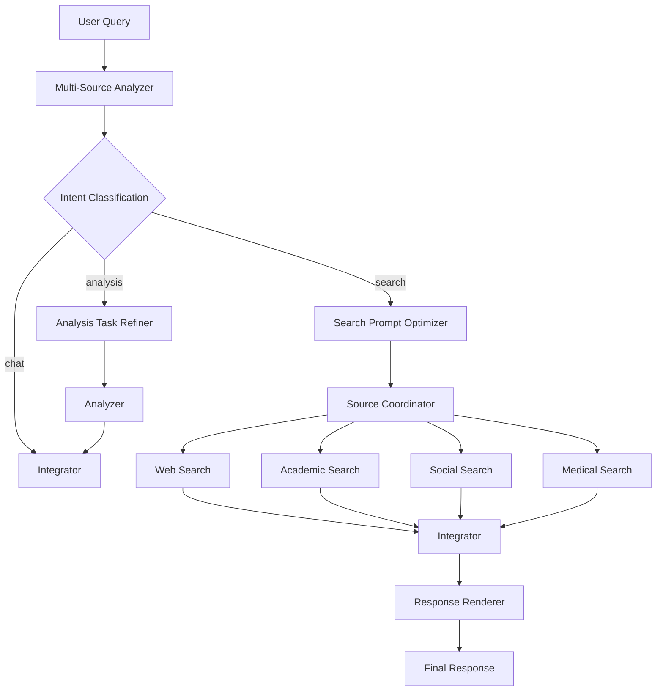
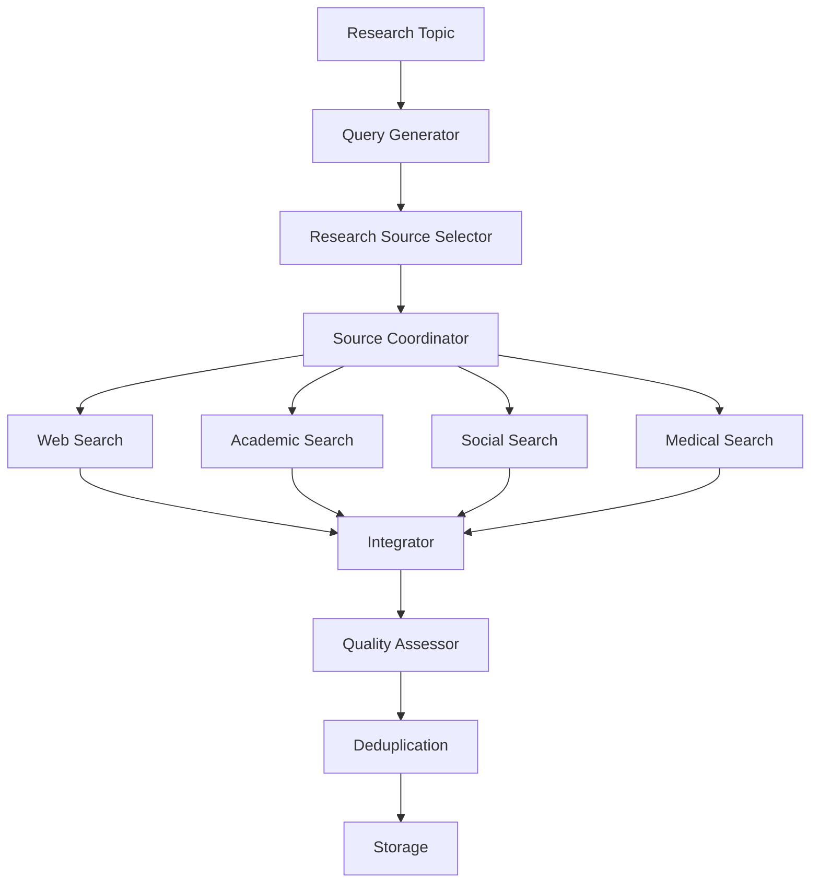

# Architecture Overview

## Multi-Source Search System

The researcher-prototype uses an intelligent multi-source search architecture that replaced the previous single-choice router system.

### Core Components

#### 1. Multi-Source Analyzer (`multi_source_analyzer_node.py`)
- **Purpose**: Replaces the old router with intelligent intent classification
- **Intents**: 
  - `chat`: General conversation, greetings, simple questions
  - `search`: Information gathering requiring external sources
  - `analysis`: Deep analysis tasks using the analyzer node
- **Source Selection**: For search queries, automatically selects up to 3 relevant sources based on query content

#### 2. Source Coordinator (`source_coordinator_node.py`)  
- **Purpose**: Manages parallel execution of selected search sources
- **Pattern**: LangGraph fan-out/fan-in for concurrent API calls
- **Sources Available**:
  - **Web Search** (`search`): Perplexity API for current information
  - **Academic Search** (`academic_search`): Semantic Scholar for research papers
  - **Social Search** (`social_search`): Hacker News API for community discussions
  - **Medical Search** (`medical_search`): PubMed for medical literature

#### 3. Integrator (`integrator_node.py`)
- **Purpose**: Synthesizes results from multiple sources
- **Features**: 
  - Graceful degradation (handles source failures)
  - Cross-referencing between sources
  - Source-aware context building
  - No artificial weighting - relies on source diversity

### Flow Diagram

### Key Improvements Over Router System

1. **Parallel Execution**: Multiple sources queried simultaneously instead of single source selection
2. **Intent-Driven**: Three distinct pathways (chat/search/analysis) instead of binary routing
3. **Graceful Degradation**: System continues working even if individual sources fail
4. **Source Diversity**: Combines different types of information (web, academic, social, medical)
5. **No Artificial Weights**: Relies on source type awareness instead of arbitrary confidence scores

### API Integration

- **Perplexity**: Web search with recency control
- **Semantic Scholar**: Academic paper search with citation data  
- **Hacker News (Algolia)**: Social/tech community discussions
- **PubMed**: Medical and life science literature

### Configuration

Source selection logic is embedded in the multi-source analyzer's prompt system. No external configuration needed for basic operation. Advanced tuning available through prompt modifications in `prompts.py`.

## Research Graph Multi-Source Integration

The autonomous research engine (`research_graph_builder.py`) now uses the same multi-source architecture:

### Research-Specific Enhancements
- **Research Source Selector**: Topic-aware source selection for autonomous research
- **Intelligent Prioritization**: Academic sources for scientific topics, medical sources for health topics
- **Parallel Research**: Multiple sources queried simultaneously for comprehensive coverage
- **Quality Assessment**: Results evaluated across source types before storage

### Research Flow

This ensures autonomous research benefits from the same comprehensive source coverage as interactive chat sessions.
