# Autonomous Research Engine

The **autonomous research engine** runs in the background, gathering high-quality information on the topics you mark as interesting.  It does not block normal chat usage and can be turned on/off at any time.

## Why?

• Free the user from manual searching.  
• Surface fresh, credible insights.  
• Keep the assistant's knowledge up-to-date.

## How it Works

1. **Topic discovery** – after each chat message the `topic_extractor_node` suggests candidate topics.  
2. **Subscription** – the UI lets you enable research per topic; selected topics are persisted in `storage_data/`.
3. **Intelligent motivation model** – hierarchical system with global drives (boredom/curiosity/tiredness/satisfaction) that gate overall research activity, plus per-topic evaluation that prioritizes which specific topics to research based on staleness, user engagement, and success rates.
4. **Graph workflow** – the research LangGraph (`research_graph_builder.py`) runs: initialization ➜ query generation ➜ source selection ➜ multi-source search coordination ➜ integration ➜ quality scoring ➜ deduplication ➜ storage.
5. **Review** – findings appear in the sidebar with summary, quality bars & source links.

## Multi-Source Search Architecture

The system uses an intelligent multi-source analyzer that replaces the previous single-choice router:

### Intent Classification
The `multi_source_analyzer_node` classifies user queries into three intents:
- **chat**: General conversation, greetings, simple questions
- **search**: Information gathering requiring external sources  
- **analysis**: Deep analysis tasks using the analyzer node

### Source Selection (Search Intent)
For search queries, the system automatically selects up to 3 relevant sources:
- **Web Search** (`search`): Current information, news, general topics
- **Academic Search** (`academic_search`): Scholarly articles via Semantic Scholar
- **Social Search** (`social_search`): Community discussions via Hacker News API
- **Medical Search** (`medical_search`): Medical literature via PubMed

### Parallel Execution
The `source_coordinator_node` executes selected search sources concurrently using LangGraph's fan-out/fan-in pattern, then the `integrator_node` synthesizes results from all successful sources while gracefully handling any failures.

## Autonomous Research Multi-Source Flow

The autonomous research engine now leverages the same multi-source capabilities as the chat system:

### Research-Specific Source Selection
1. **Research Source Selector** (`research_source_selector_node`): Analyzes research topics to select the most appropriate sources
   - **Scientific/Technical Topics**: Academic + Web sources
   - **Medical/Health Topics**: Medical + Academic sources  
   - **Technology/Startup Topics**: Web + Social sources
   - **Current Events**: Web + Social sources
   - **Academic Fields**: Academic + Medical (if health-related)

### Enhanced Research Workflow
```
Research Topic → Query Generation → Source Selection → Multi-Source Search → Integration → Quality Assessment → Deduplication → Storage
```

### Benefits for Autonomous Research
- **Comprehensive Coverage**: Multiple perspectives on each research topic
- **Source Diversity**: Academic rigor combined with current developments
- **Parallel Efficiency**: All sources searched simultaneously
- **Quality Filtering**: Results assessed across multiple source types
- **Automatic Relevance**: Sources selected based on topic characteristics

## Hierarchical Motivation System

The research engine uses a two-tier intelligent motivation system combining global drives with per-topic evaluation for optimal research scheduling.

### Tier 1: Global Motivation Gates
Global drives determine whether any research should occur at all:

```
global_motivation = (boredom + curiosity) - (tiredness + satisfaction)
```

**Research cycle triggers when**: `global_motivation ≥ MOTIVATION_THRESHOLD`

### Tier 2: Per-Topic Prioritization  
When globally motivated, the system evaluates each topic individually:

```
topic_score = staleness_pressure + (engagement_score × weight) + (quality_score × weight)
```

**Topics researched when**: `topic_score ≥ TOPIC_MOTIVATION_THRESHOLD`

#### Staleness Pressure Calculation
```
staleness_pressure = time_since_last_research × staleness_coefficient × TOPIC_STALENESS_SCALE
```

- **staleness_coefficient**: LLM-assessed per-topic urgency (0.1=stable, 2.0=breaking news)
- **time_since_last_research**: Hours since topic was last researched  
- **TOPIC_STALENESS_SCALE**: Configurable time-to-pressure conversion (default: 0.0001)

#### Drive Updates Over Time

| Drive | When Active | Update Formula |
|-------|-------------|----------------|
| **Boredom** | Always (idle) | `boredom += BOREDOM_RATE × time_delta` |
| **Curiosity** | Always | `curiosity -= CURIOSITY_DECAY × time_delta` |
| **Tiredness** | During research | `tiredness += time_delta` then `tiredness -= TIREDNESS_DECAY × time_delta` |
| **Satisfaction** | After research | `satisfaction += quality_score` then `satisfaction -= SATISFACTION_DECAY × time_delta` |

### Hierarchical Flow Diagram

```mermaid
stateDiagram-v2
    [*] --> Idle
    Idle --> GlobalCheck : "Check global motivation"
    GlobalCheck --> Idle : "motivation < threshold"
    GlobalCheck --> TopicEval : "motivation ≥ MOTIVATION_THRESHOLD"
    TopicEval --> NoTopics : "no topics above TOPIC_MOTIVATION_THRESHOLD"
    TopicEval --> Researching : "prioritized topics found"
    NoTopics --> Idle : "wait for next cycle"
    Researching --> Idle : "research complete<br/>satisfaction ↑, tiredness ↑"
    
    note right of Idle : "• Global drives accumulate/decay<br/>• Topic staleness increases"
    note right of TopicEval : "• Evaluate each topic:<br/>  staleness + engagement + quality<br/>• Sort by priority"
    note right of Researching : "• Research highest priority topics<br/>• Update engagement data"
```

### Parameter Impact Examples

With default values (`THRESHOLD=2.0`, `BOREDOM_RATE=0.0005`, `CURIOSITY_DECAY=0.0002`):

```mermaid
graph LR
    A["🕐 Time: 0h<br/>Motivation: 0"] --> B["🕐 Time: 2h<br/>Motivation: 1.0<br/>(boredom accumulated)"]
    B --> C["🕐 Time: 4h<br/>Motivation: 2.0<br/>🚀 RESEARCH TRIGGERED"]
    C --> D["🕐 Research Complete<br/>Motivation: -1.0<br/>(satisfaction + tiredness)"]
    D --> E["🕐 Time: 6h<br/>Motivation: 0.5<br/>(drives decay)"]
```



## Controlling the Engine

| Action | HTTP route | Front-end |
|--------|-----------|-----------|
| Start | `POST /research/control/start` | EngineSettings modal |
| Stop  | `POST /research/control/stop`  | EngineSettings modal |
| Trigger single cycle | `POST /research/trigger/{userId}` |  Topics dashboard "🚀 Research Now" |

### Motivation debug

* `GET  /research/debug/motivation` – current drive values
* `POST /research/debug/adjust-drives` – set boredom/curiosity… manually
* `POST /research/debug/update-config` – override threshold & decay rates at runtime

### Parameter Tuning Guide

#### Global Motivation Parameters
| Behavior Goal | Parameter Changes | Effect |
|---------------|------------------|--------|
| **More frequent research** | ↑ `BOREDOM_RATE` or ↓ `MOTIVATION_THRESHOLD` | Triggers research sooner |
| **Less frequent research** | ↓ `BOREDOM_RATE` or ↑ `MOTIVATION_THRESHOLD` | Longer intervals between research |
| **Longer research sessions** | ↓ `TIREDNESS_DECAY` | Takes longer to get tired |
| **Shorter research sessions** | ↑ `TIREDNESS_DECAY` | Gets tired faster |
| **More persistent curiosity** | ↓ `CURIOSITY_DECAY` | Curiosity lasts longer |
| **Quick satisfaction reset** | ↑ `SATISFACTION_DECAY` | Ready for new research sooner |

#### Per-Topic Parameters  
| Behavior Goal | Parameter Changes | Effect |
|---------------|------------------|--------|
| **Research more topics per cycle** | ↓ `TOPIC_MOTIVATION_THRESHOLD` | Lower bar for topic selection |
| **Only research high-priority topics** | ↑ `TOPIC_MOTIVATION_THRESHOLD` | Higher bar for topic selection |
| **Prioritize user engagement more** | ↑ `TOPIC_ENGAGEMENT_WEIGHT` | Heavily used topics get priority |
| **Prioritize research quality more** | ↑ `TOPIC_QUALITY_WEIGHT` | Successful topics get priority |  
| **Faster staleness pressure buildup** | ↑ `TOPIC_STALENESS_SCALE` | Topics become urgent sooner |
| **Slower staleness pressure buildup** | ↓ `TOPIC_STALENESS_SCALE` | Topics stay fresh longer |

#### Example Configurations

**Aggressive Research** (every ~1 hour):
```env
MOTIVATION_THRESHOLD=1.5
MOTIVATION_BOREDOM_RATE=0.001
```

**Conservative Research** (every ~6 hours):
```env
MOTIVATION_THRESHOLD=3.0
MOTIVATION_BOREDOM_RATE=0.0002
```

### Best Practices

* Begin with 1-2 focused topics (e.g. "GPT-4 performance benchmarks").
* Lower `RESEARCH_QUALITY_THRESHOLD` if you prefer more-but-noisier findings.
* Use the debug API (`/research/debug/motivation`) to monitor drive levels.
* Periodically mark findings as read or delete old ones to keep the sidebar tidy.

## Configuration Reference

All variables live in `backend/.env` (see template):

```env
# Research Engine
RESEARCH_ENGINE_ENABLED=true
RESEARCH_MODEL=gpt-4o-mini
RESEARCH_QUALITY_THRESHOLD=0.6
RESEARCH_MAX_TOPICS_PER_USER=3

# Global Motivation Drives
MOTIVATION_THRESHOLD=2.0
MOTIVATION_BOREDOM_RATE=0.0005
MOTIVATION_CURIOSITY_DECAY=0.0002
MOTIVATION_TIREDNESS_DECAY=0.0002
MOTIVATION_SATISFACTION_DECAY=0.0002

# Per-Topic Motivation (NEW)
TOPIC_MOTIVATION_THRESHOLD=0.5      # Minimum score for individual topic research
TOPIC_ENGAGEMENT_WEIGHT=0.3         # Weight of user engagement in topic scoring
TOPIC_QUALITY_WEIGHT=0.2           # Weight of research success rate in scoring  
TOPIC_STALENESS_SCALE=0.0001       # Scale factor converting time to staleness pressure
```

### Staleness Coefficient Guidelines

The LLM automatically assigns staleness coefficients during topic extraction:
- **2.0**: Breaking news, urgent developments
- **1.5**: Technology trends, current events  
- **1.0**: General topics (default)
- **0.5**: Historical or theoretical topics
- **0.1**: Reference material, stable facts 