# Autonomous Research Engine

The **autonomous research engine** runs in the background, gathering high-quality information on the topics you mark as interesting.  It does not block normal chat usage and can be turned on/off at any time.

## Why?

• Free the user from manual searching.  
• Surface fresh, credible insights.  
• Keep the assistant's knowledge up-to-date.

## How it Works

1. **Topic discovery** – after each chat message the `topic_extractor_node` suggests candidate topics.  
2. **Subscription** – the UI lets you enable research per topic; selected topics are persisted in `storage_data/`.
3. **Motivation model** – internal boredom / curiosity / tiredness / satisfaction drives decide when to launch a research cycle (default every ~2 h on average).  You can tweak rates & threshold via environment variables or debug APIs.
4. **Graph workflow** – the research LangGraph (`research_graph_builder.py`) runs: query generation ➜ web search ➜ quality scoring ➜ deduplication ➜ storage.
5. **Review** – findings appear in the sidebar with summary, quality bars & source links.

## Motivation System Mechanics

The research engine uses a drive-based motivation system where **boredom** and **curiosity** accumulate over time, while **tiredness** and **satisfaction** act as inhibitors during research.

### Drive Equations

The motivation level is calculated as:
```
motivation = (boredom + curiosity) - (tiredness + satisfaction)
```

**Research triggers when**: `motivation ≥ MOTIVATION_THRESHOLD`

#### Drive Updates Over Time

| Drive | When Active | Update Formula |
|-------|-------------|----------------|
| **Boredom** | Always (idle) | `boredom += BOREDOM_RATE × time_delta` |
| **Curiosity** | Always | `curiosity -= CURIOSITY_DECAY × time_delta` |
| **Tiredness** | During research | `tiredness += time_delta` then `tiredness -= TIREDNESS_DECAY × time_delta` |
| **Satisfaction** | After research | `satisfaction += quality_score` then `satisfaction -= SATISFACTION_DECAY × time_delta` |

### Visual Flow Diagram


### Parameter Impact Examples

With default values (`THRESHOLD=2.0`, `BOREDOM_RATE=0.0005`, `CURIOSITY_DECAY=0.0002`):

```mermaid
graph LR
    A["🕐 Time: 0h<br/>Motivation: 0"] --> B["🕐 Time: 2h<br/>Motivation: 1.0<br/>(boredom accumulated)"]
    B --> C["🕐 Time: 4h<br/>Motivation: 2.0<br/>🚀 RESEARCH TRIGGERED"]
    C --> D["🕐 Research Complete<br/>Motivation: -1.0<br/>(satisfaction + tiredness)"]
    D --> E["🕐 Time: 6h<br/>Motivation: 0.5<br/>(drives decay)"]
```



## Controlling the Engine

| Action | HTTP route | Front-end |
|--------|-----------|-----------|
| Start | `POST /research/control/start` | EngineSettings modal |
| Stop  | `POST /research/control/stop`  | EngineSettings modal |
| Trigger single cycle | `POST /research/trigger/{userId}` |  Topics dashboard "🚀 Research Now" |

### Motivation debug

* `GET  /research/debug/motivation` – current drive values
* `POST /research/debug/adjust-drives` – set boredom/curiosity… manually
* `POST /research/debug/update-config` – override threshold & decay rates at runtime

### Parameter Tuning Guide

| Behavior Goal | Parameter Changes | Effect |
|---------------|------------------|--------|
| **More frequent research** | ↑ `BOREDOM_RATE` or ↓ `MOTIVATION_THRESHOLD` | Triggers research sooner |
| **Less frequent research** | ↓ `BOREDOM_RATE` or ↑ `MOTIVATION_THRESHOLD` | Longer intervals between research |
| **Longer research sessions** | ↓ `TIREDNESS_DECAY` | Takes longer to get tired |
| **Shorter research sessions** | ↑ `TIREDNESS_DECAY` | Gets tired faster |
| **More persistent curiosity** | ↓ `CURIOSITY_DECAY` | Curiosity lasts longer |
| **Quick satisfaction reset** | ↑ `SATISFACTION_DECAY` | Ready for new research sooner |

#### Example Configurations

**Aggressive Research** (every ~1 hour):
```env
MOTIVATION_THRESHOLD=1.5
MOTIVATION_BOREDOM_RATE=0.001
```

**Conservative Research** (every ~6 hours):
```env
MOTIVATION_THRESHOLD=3.0
MOTIVATION_BOREDOM_RATE=0.0002
```

### Best Practices

* Begin with 1-2 focused topics (e.g. "GPT-4 performance benchmarks").
* Lower `RESEARCH_QUALITY_THRESHOLD` if you prefer more-but-noisier findings.
* Use the debug API (`/research/debug/motivation`) to monitor drive levels.
* Periodically mark findings as read or delete old ones to keep the sidebar tidy.

## Configuration Reference (excerpt)

All variables live in `backend/.env` (see template):

```
RESEARCH_ENGINE_ENABLED=true
RESEARCH_INTERVAL_HOURS=2          # approximate cadence
RESEARCH_MODEL=gpt-4o-mini
RESEARCH_QUALITY_THRESHOLD=0.6
RESEARCH_MAX_TOPICS_PER_USER=3

# Motivation drives
MOTIVATION_THRESHOLD=2.0
MOTIVATION_BOREDOM_RATE=0.0005
MOTIVATION_CURIOSITY_DECAY=0.0002
MOTIVATION_TIREDNESS_DECAY=0.0002
MOTIVATION_SATISFACTION_DECAY=0.0002
``` 