# Autonomous Research Engine

The **autonomous research engine** runs in the background, gathering high-quality information on the topics you mark as interesting.  It does not block normal chat usage and can be turned on/off at any time.

## Why?

• Free the user from manual searching.  
• Surface fresh, credible insights.  
• Keep the assistant's knowledge up-to-date.

## How it Works

1. **Topic discovery** – after each chat message the `topic_extractor_node` suggests candidate topics.  
2. **Subscription** – the UI lets you enable research per topic; selected topics are persisted in `storage_data/`.
3. **Motivation model** – internal boredom / curiosity / tiredness / satisfaction drives decide when to launch a research cycle (default every ~2 h on average).  You can tweak rates & threshold via environment variables or debug APIs.
4. **Graph workflow** – the research LangGraph (`research_graph_builder.py`) runs: query generation ➜ web search ➜ quality scoring ➜ deduplication ➜ storage.
5. **Review** – findings appear in the sidebar with summary, quality bars & source links.

Diagram of drives:

```mermaid
stateDiagram-v2
    [*] --> Idle
    Idle -->|boredom ↑| Motivated
    Motivated -->|spawns research| Researching
    Researching -->|tiredness ↑ satisfaction ↑| Idle
```



## Controlling the Engine

| Action | HTTP route | Front-end |
|--------|-----------|-----------|
| Start | `POST /research/control/start` | EngineSettings modal |
| Stop  | `POST /research/control/stop`  | EngineSettings modal |
| Trigger single cycle | `POST /research/trigger/{userId}` |  Topics dashboard "🚀 Research Now" |

### Motivation debug

* `GET  /research/debug/motivation` – current drive values
* `POST /research/debug/adjust-drives` – set boredom/curiosity… manually
* `POST /research/debug/update-config` – override threshold & decay rates at runtime

### Best Practices

* Begin with 1-2 focused topics (e.g. "GPT-4 performance benchmarks").
* Lower `RESEARCH_QUALITY_THRESHOLD` if you prefer more-but-noisier findings.
* Periodically mark findings as read or delete old ones to keep the sidebar tidy.

## Configuration Reference (excerpt)

All variables live in `backend/.env` (see template):

```
RESEARCH_ENGINE_ENABLED=true
RESEARCH_INTERVAL_HOURS=2          # approximate cadence
RESEARCH_MODEL=gpt-4o-mini
RESEARCH_QUALITY_THRESHOLD=0.6
RESEARCH_MAX_TOPICS_PER_USER=3

# Motivation drives
MOTIVATION_THRESHOLD=2.0
MOTIVATION_BOREDOM_RATE=0.0005
MOTIVATION_CURIOSITY_DECAY=0.0002
MOTIVATION_TIREDNESS_DECAY=0.0002
MOTIVATION_SATISFACTION_DECAY=0.0002
``` 